# 公司内部后台管理系统

系统功能：给公司内部管理员用的后台，管员工账号、岗位和部门，登录后先看全公司有多少人、人在哪些部门。

技术栈：Vue + Django + MySQL

本机运行说明：[SETUP.md](./SETUP.md)

## 一、整体

左边两个菜单：**组织人事**（员工、岗位、部门）、**人员概况**。

### 1. 登录

输入账号和密码，点「登录」。密码不对或账号被停用，都进不去。

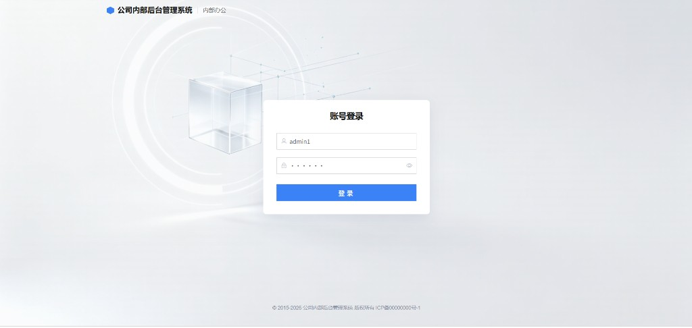

### 2. 人员概况

登录后的第一页。上面三张卡片是员工、岗位、部门各有多少；左边饼图看人在哪些部门，右边柱状图看各岗位有多少人。

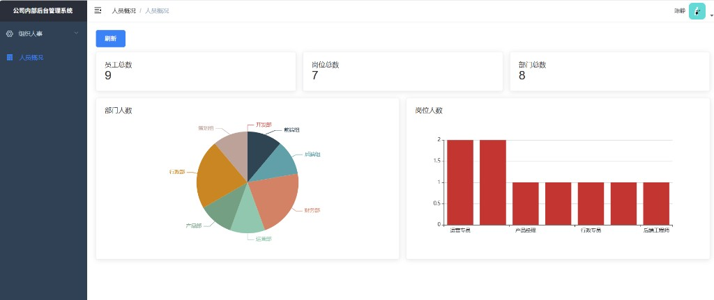

### 3. 员工管理

员工名单：账号、姓名、手机号、部门、岗位。开关打开表示能登录，灰色表示暂时停用（账号还在，只是进不了系统）。

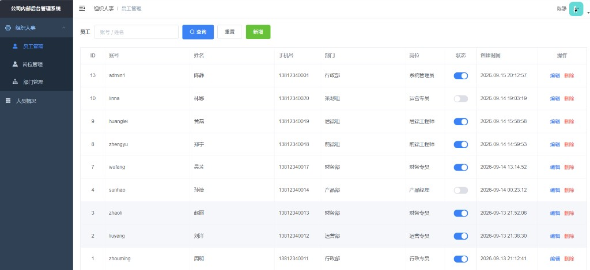

### 4. 岗位管理

岗位就是工作职务，例如运营专员、财务专员、前端工程师。

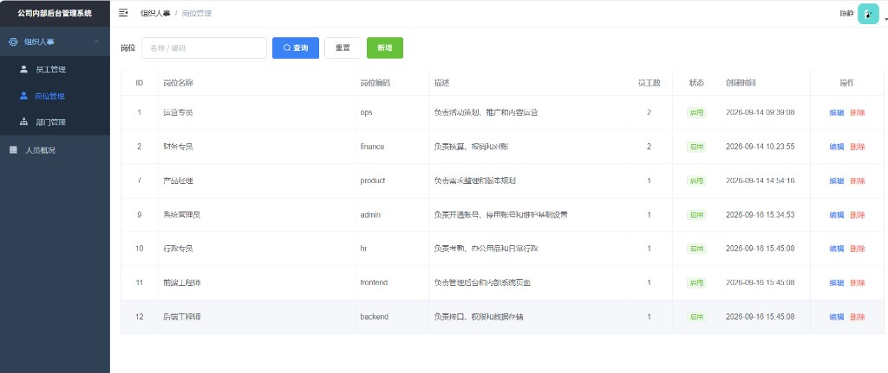

### 5. 部门管理

公司组织架构。大部门下面可以挂小组，例如开发部下有前端组、后端组。

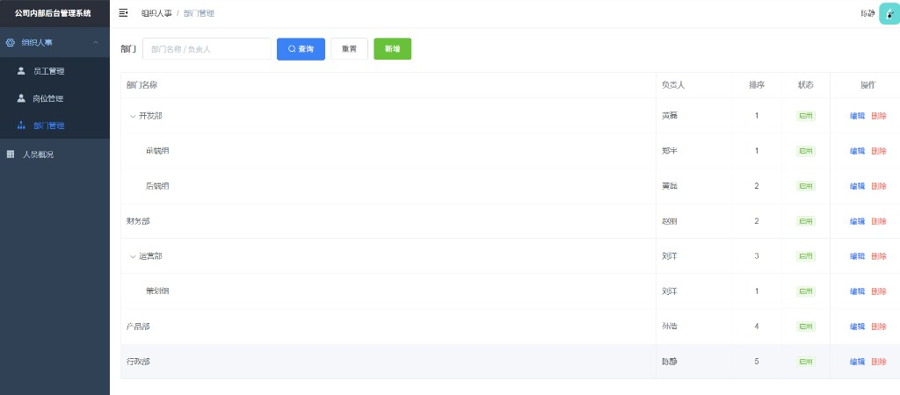

---

## 二、具体功能

员工、岗位、部门都是同一套操作：搜索、新增、编辑、删除。删之前会再确认一次。不能删除自己正在登录的账号。

### 1. 员工管理

**增：** 点绿色「新增」，填账号、密码、姓名、手机号、部门、岗位，点确定。

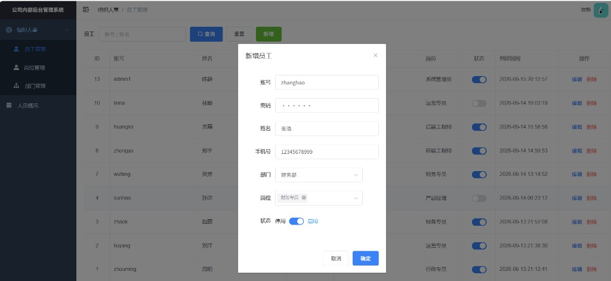

**查：** 输入账号或姓名，点「查询」。例如搜「张浩」，只留下这一条。

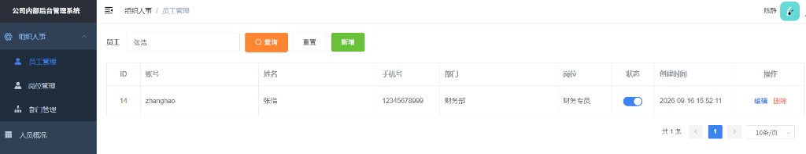

**改：** 点「编辑」，改部门、岗位等。密码空着表示不改密码。

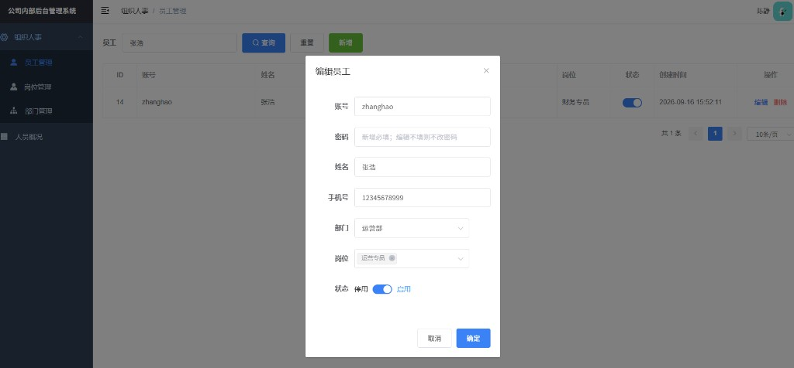

**删：** 点「删除」会先问一句，确认后才去掉。

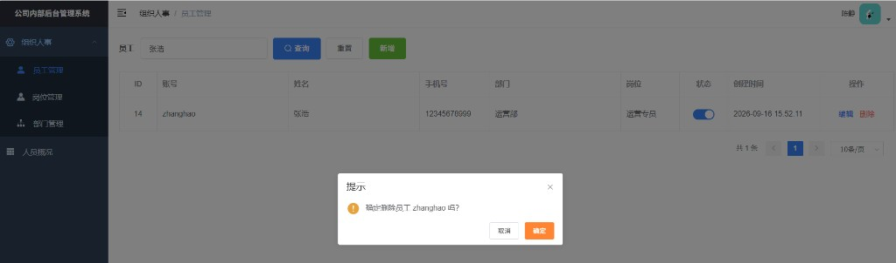

### 2. 岗位管理

**增：** 点「新增」，填岗位名称、英文编码、描述。

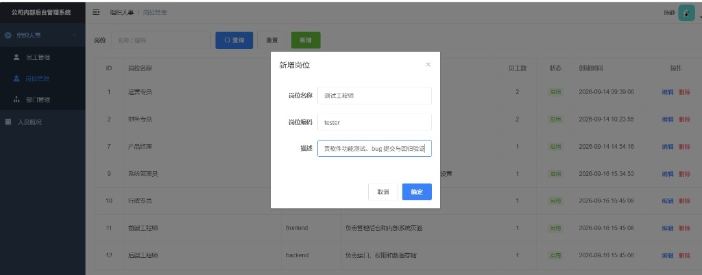

**查：** 按名称或编码搜索。例如搜「测试」，只留下测试工程师。

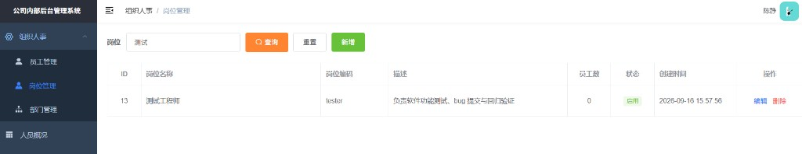

**改：** 点「编辑」，改名称、编码或描述。

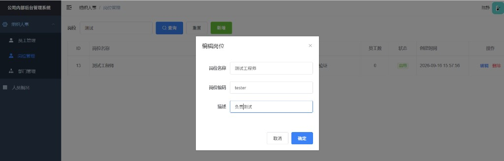

**删：** 点「删除」后确认，才会去掉这个岗位。

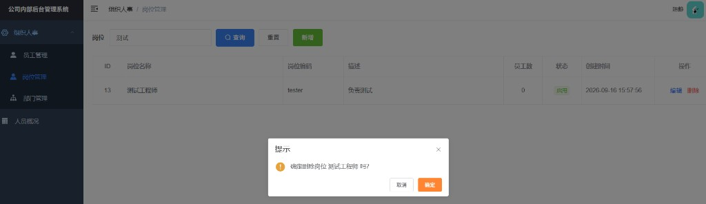

### 3. 部门管理

**增：** 点「新增」，填部门名称、负责人、排序。上级部门不选，就是最外层的大部门。

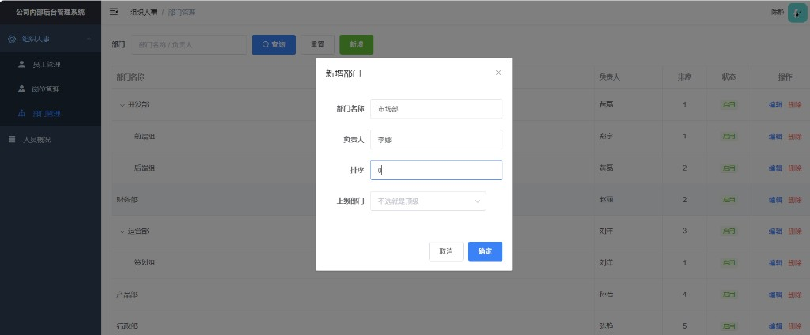

**查：** 按部门名称或负责人搜索。例如搜「市场部」，只留下这一条。

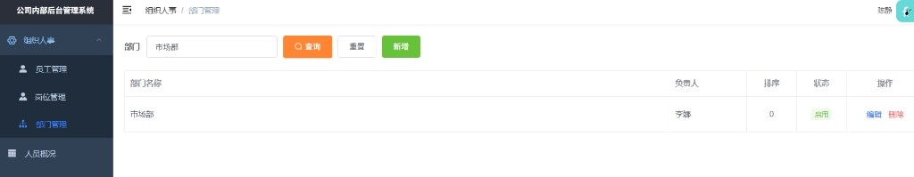

**改：** 点「编辑」，可改名称、负责人、排序，或改它挂在哪个上级下面。

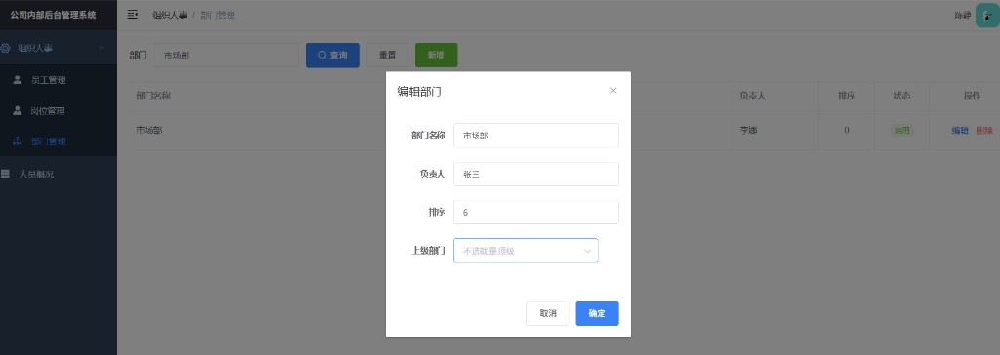

**删：** 点「删除」后确认，才会去掉这个部门。

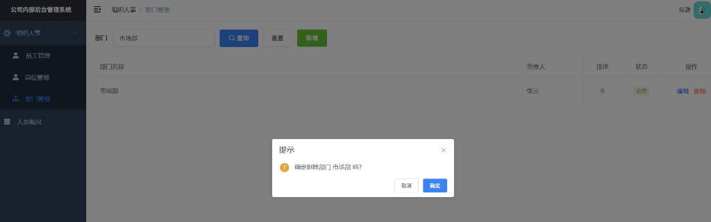
